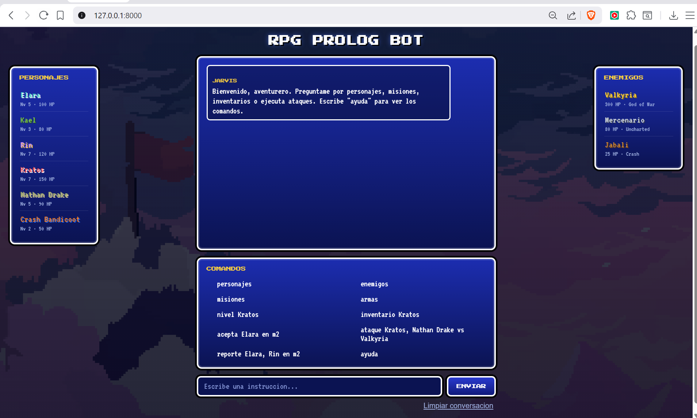
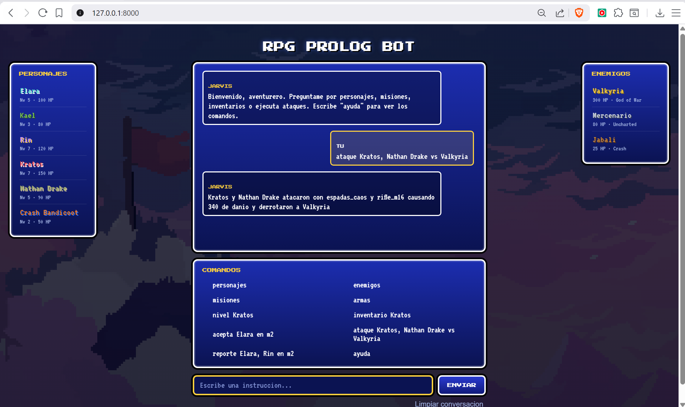
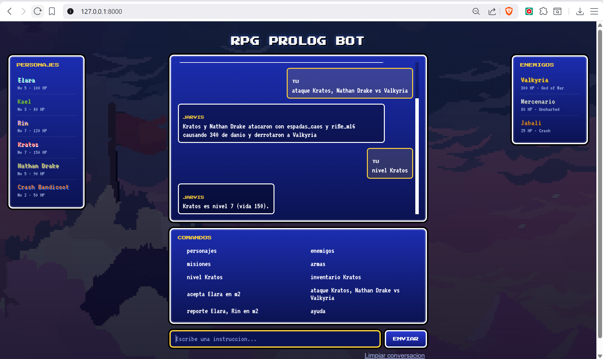

# RPG Prolog Bot

**Materia:** Lenguajes de Programación | **Periodo:** Ordinario 1 - 2026 | **Estado:** En curso

Interfaz web en **Laravel** que consulta una **base de conocimiento en SWI-Prolog**
para simular un juego de rol (RPG). El usuario interactúa con un **chatbot**: escribe
una instrucción, el sistema arma la consulta Prolog correspondiente, la ejecuta sobre
la base de conocimiento y narra el resultado. La interfaz toma su estética de los
**Dragon Quest clásicos** (era SNES): ventanas azules, tipografía pixelada y paneles
de personajes y enemigos.

## Equipo de trabajo

- [Daniel Vaca](https://github.com/DanielV-13)

## Capturas / Demo



Ejecución de un ataque grupal:



Consulta del nivel de un personaje:



> Demo local en `http://127.0.0.1:8000`

## Funcionalidad

- [x] Base de conocimiento en Prolog: personajes, enemigos, misiones, armas e inventarios [Commit](https://github.com/DanielV-13/Actividad_Recuperacion_Prolog_Laravel/commit/d74bab70f116eb65dd97bd26303a92c0781a7bc8)
- [x] 2 reglas nuevas sobre el proyecto de clase: `tiene_arma/1` y `es_alto_nivel/1` [Commit](https://github.com/DanielV-13/Actividad_Recuperacion_Prolog_Laravel/commit/d74bab70f116eb65dd97bd26303a92c0781a7bc8)
- [x] Chatbot en Laravel que traduce instrucciones a consultas Prolog reales [Commit](https://github.com/DanielV-13/Actividad_Recuperacion_Prolog_Laravel/commit/8654431dbfe03fb7d65d58610891c31d4d6ce69c)
- [x] Combate individual y grupal con narración (constructor de oraciones) [Commit](https://github.com/DanielV-13/Actividad_Recuperacion_Prolog_Laravel/commit/8654431dbfe03fb7d65d58610891c31d4d6ce69c)
- [x] Salida limpia sin advertencias de SWI-Prolog [Commit](https://github.com/DanielV-13/Actividad_Recuperacion_Prolog_Laravel/commit/a21da2a855fd8f7077406cf767ed000b2758ec39)
- [x] Interfaz estilo Dragon Quest: pixel art, ventanas SNES y paneles laterales [Commit](https://github.com/DanielV-13/Actividad_Recuperacion_Prolog_Laravel/commit/f13612c5dfd983c6433af7a8ea16d39811f6e1f7)
- [x] Comando `nivel` y resolución de nombres sin distinción de mayúsculas [Commit](https://github.com/DanielV-13/Actividad_Recuperacion_Prolog_Laravel/commit/a5f9572062ea4354d5178a2894bf6adbc0b45a49)

## Tecnologías

`PHP 8.2` | `Laravel 12` | `SWI-Prolog 9` | `HTML/CSS3` | `Press Start 2P / VT323`

## Ejecución

Requisitos previos: **PHP 8.2+**, **Composer** y **SWI-Prolog** instalados (este último
agregado al PATH).

```bash
# 1. Clonar el repositorio
git clone https://github.com/DanielV-13/Actividad_Recuperacion_Prolog_Laravel.git
cd Actividad_Recuperacion_Prolog_Laravel

# 2. Instalar dependencias de PHP (crea la carpeta vendor/)
composer install

# 3. Levantar el servidor
php artisan serve
# Abrir http://127.0.0.1:8000
```

El archivo `.env` ya viene listo (con `APP_KEY` y sesión/caché en archivos, sin base de
datos). Si `swipl` no está en el PATH, indica su ruta en `.env` con `SWIPL_PATH`.

### Comandos del chatbot

| Instrucción | Ejemplo |
|-------------|---------|
| Listar personajes | `personajes` |
| Listar enemigos | `enemigos` |
| Listar misiones | `misiones` |
| Listar armas | `armas` |
| Ver nivel y vida | `nivel Kratos` |
| Ver inventario | `inventario Kratos` |
| ¿Puede aceptar misión? | `acepta Elara en m2` |
| Ataque (individual o grupal) | `ataque Kratos, Nathan Drake vs Valkyria` |
| Reporte de grupo / misión | `reporte Elara, Rin en m2` |
| Ayuda | `ayuda` |

## Métricas de Progreso

| Indicador | Valor |
|-----------|-------|
| Commits totales | 6 |
| Issues/PRs fusionados | 0 / 0 |
| Cobertura de pruebas | N/A |
| Última actualización | 2026-06-18 |

## Reflexión y Aprendizajes

- **Habilidades desarrolladas:** integración de un lenguaje lógico (Prolog) con un
  framework MVC (Laravel); diseño de un intérprete de comandos en lenguaje casi natural;
  ejecución de procesos externos desde PHP; control de versiones con Git y GitHub.
- **Qué funcionó bien:** generar el objetivo Prolog en un archivo temporal evitó los
  problemas de comillas entre Windows y Linux; reutilizar el constructor de oraciones
  para narrar los combates; y resolver los nombres dentro de la propia base de
  conocimiento (`downcase_atom`) mantuvo la lógica del lado declarativo.
- **Qué se podría mejorar:** añadir pruebas automatizadas; soportar instrucciones en
  lenguaje más libre; persistir el estado del juego; e incorporar sprites de los
  personajes y enemigos.
- **Conceptos clave aplicados de la materia:** hechos y reglas, unificación, recursión
  (`xp_acumulada`, `sumar_xp_grupo`, `resolver_grupo`), backtracking, predicados de orden
  superior (`forall`), y el contraste entre el paradigma **declarativo** de Prolog y el
  **imperativo** de PHP.
```
